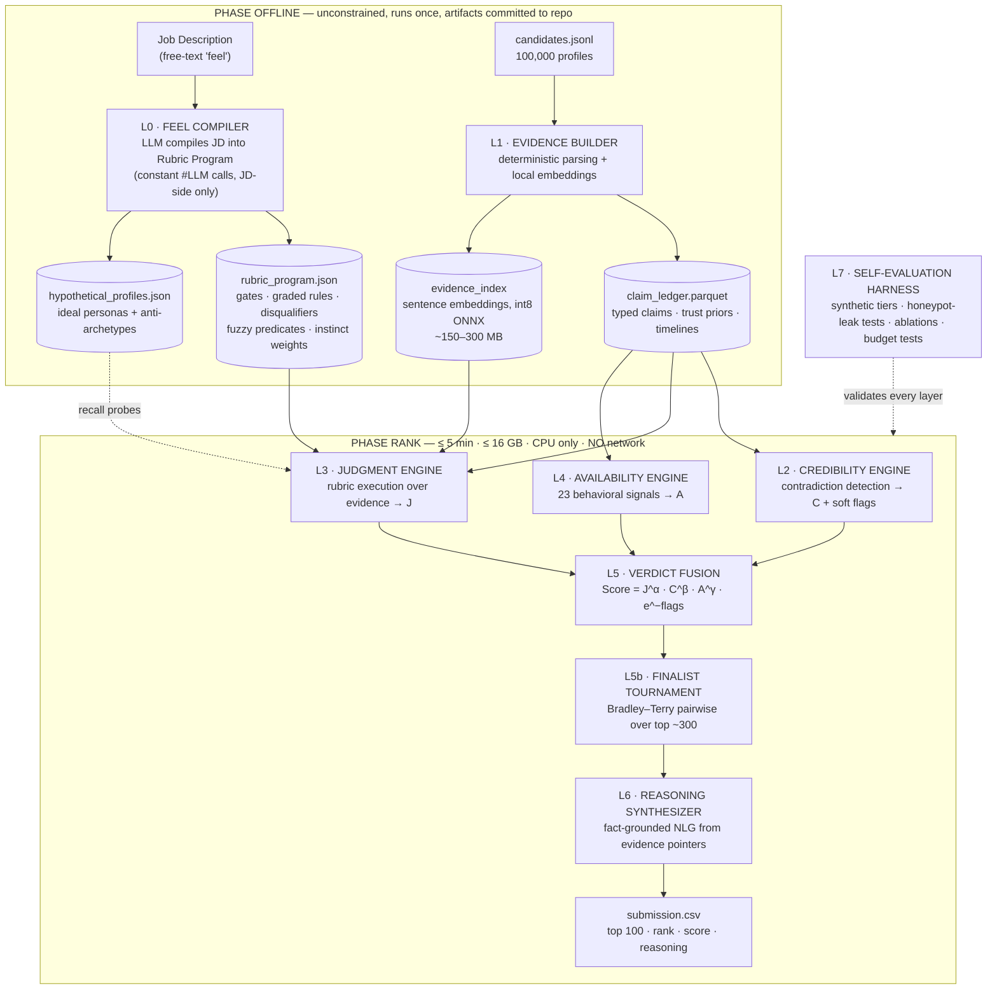
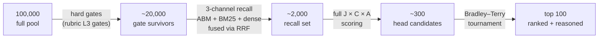
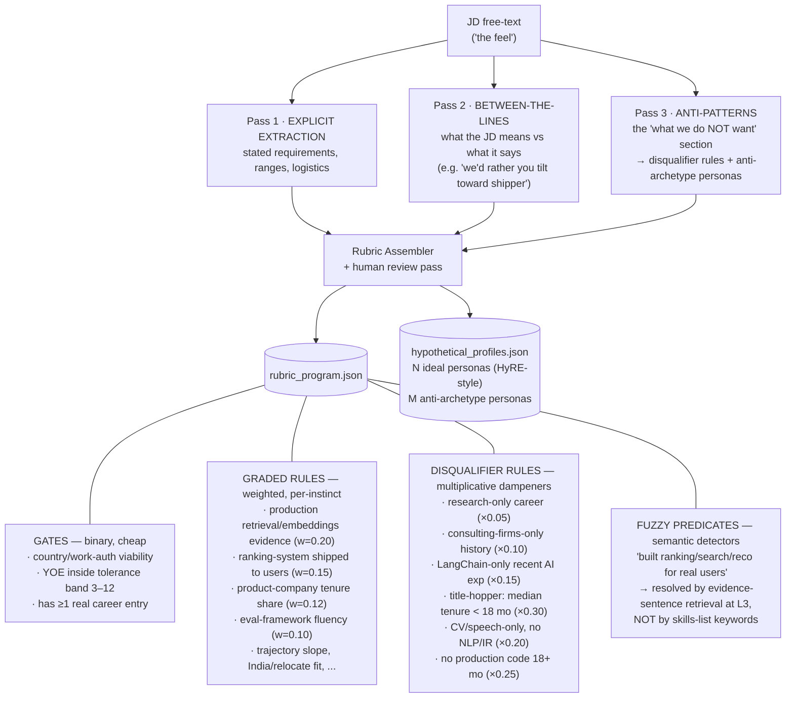
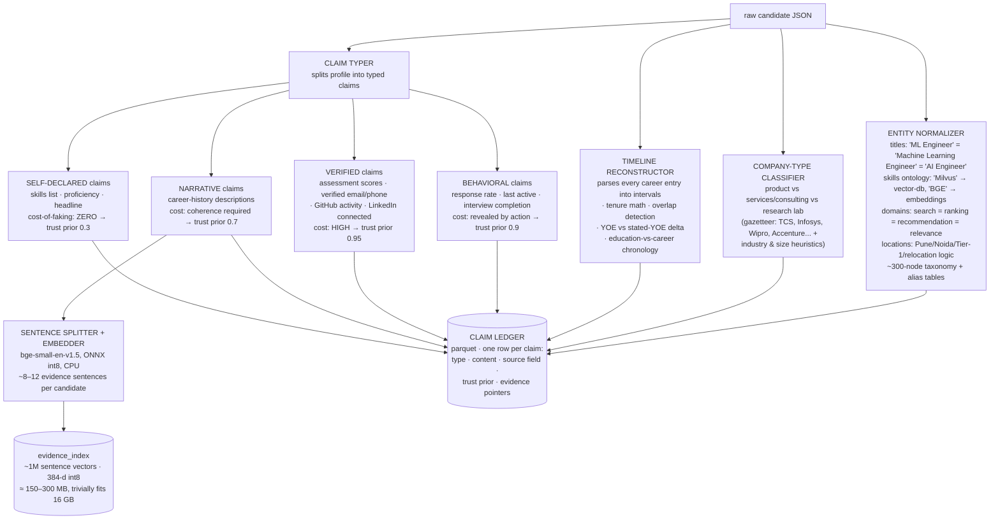
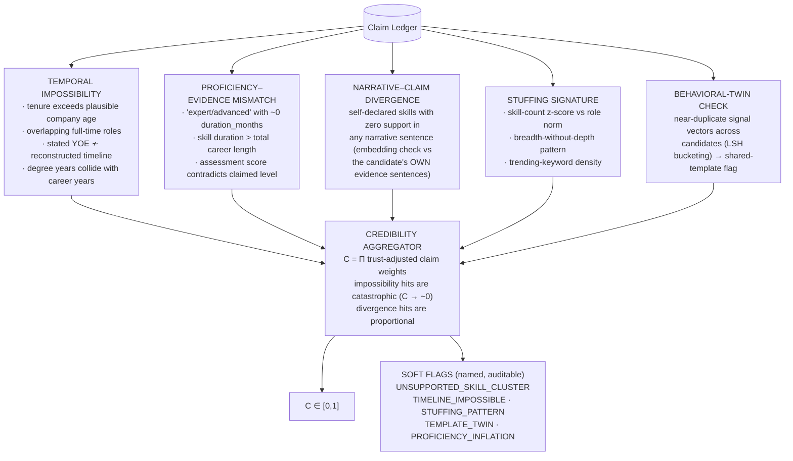
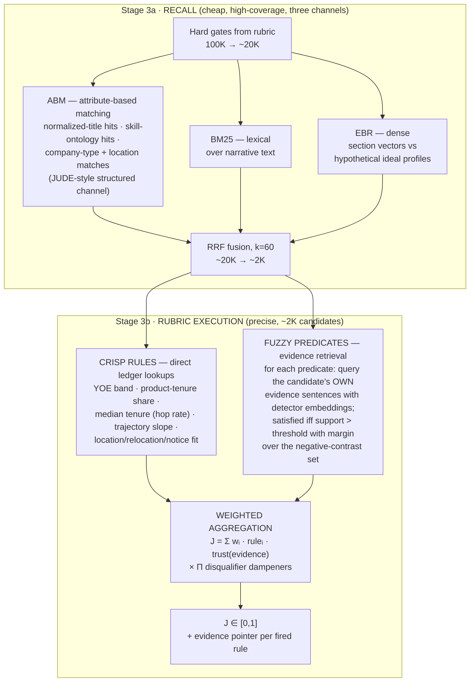
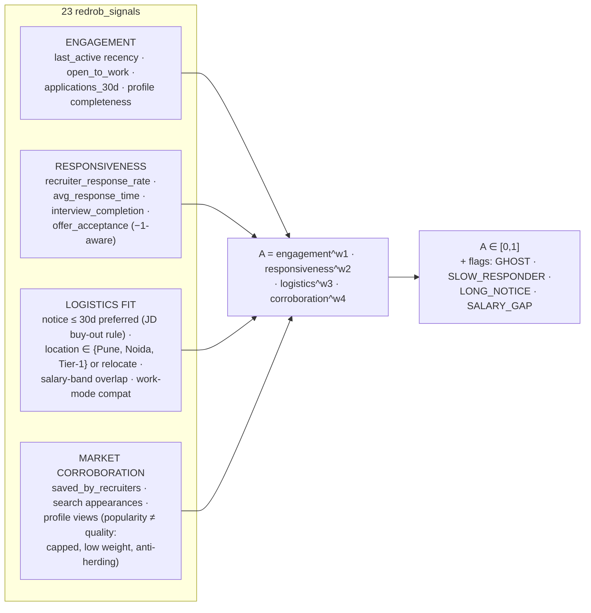
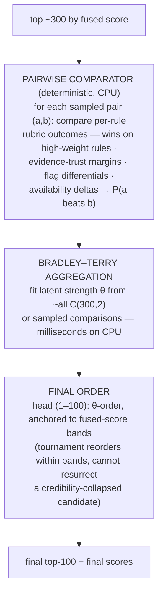
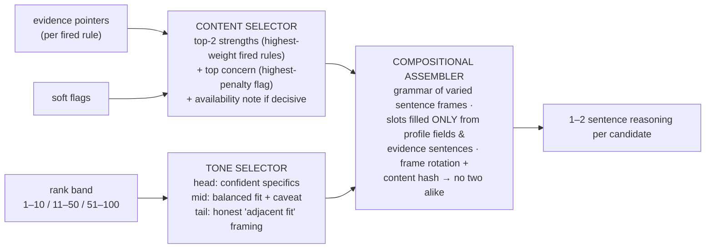
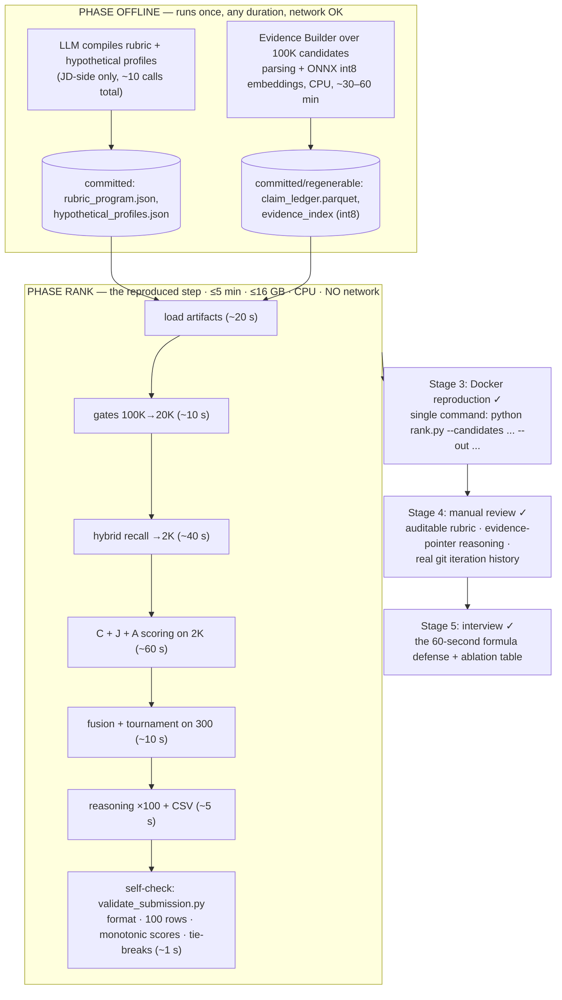

# VERDICT — Verified Evidence, Rubric-Driven Inference & Calibrated Triage

**An AI candidate-ranking architecture that judges like a great recruiter — instead of measuring like a search engine.**

Designed for the Redrob *Intelligent Candidate Discovery & Ranking Challenge*: rank the top 100 of 100,000 candidates against the "Senior AI Engineer — Founding Team" JD, under hard constraints (ranking step ≤ 5 min wall-clock, ≤ 16 GB RAM, CPU-only, **zero network access**), against a deliberately adversarial dataset (keyword stuffers, plain-language hidden gems, behavioral twins, ~80 honeypot profiles).

---

## Table of Contents

1. [The Thesis — Feel, Instinct, and Why Similarity Fails](#1-the-thesis)
2. [Research Survey & Gap Analysis](#2-research-survey--gap-analysis)
3. [The Core Formula — Our Own Algorithm](#3-the-core-formula)
4. [System Overview](#4-system-overview)
5. [Layer 0 — The Feel Compiler (JD → Rubric Program)](#5-layer-0--the-feel-compiler)
6. [Layer 1 — The Evidence Builder (Candidate → Claim Ledger)](#6-layer-1--the-evidence-builder)
7. [Layer 2 — The Credibility Engine (Doubt)](#7-layer-2--the-credibility-engine)
8. [Layer 3 — The Judgment Engine (Rubric Execution)](#8-layer-3--the-judgment-engine)
9. [Layer 4 — The Availability Engine (Forecast)](#9-layer-4--the-availability-engine)
10. [Layer 5 — Verdict Fusion & the Finalist Tournament](#10-layer-5--verdict-fusion--the-finalist-tournament)
11. [Layer 6 — The Reasoning Synthesizer](#11-layer-6--the-reasoning-synthesizer)
12. [Layer 7 — Self-Evaluation Harness](#12-layer-7--self-evaluation-harness)
13. [Two-Phase Compute Strategy & Constraint Compliance](#13-two-phase-compute-strategy)
14. [Trap-by-Trap Defense Matrix](#14-trap-by-trap-defense-matrix)
15. [Appendix A — The Rejected v1 Design (and why it died)](#15-appendix-a--the-rejected-v1-design)
16. [Appendix B — Production Extension: the Live "Feel" Surface](#16-appendix-b--production-extension)
17. [References](#17-references)

---

## 1. The Thesis

Recruiters go through hundreds of profiles and still miss the right person — not because the talent isn't there, but because keyword filters can't see what actually matters.

A recruiter doesn't start from a checklist. They start from a **feel** — *"I need someone who shipped real ranking systems at a product company, who won't bolt in 18 months, and who will actually answer my message."* That feel decomposes into **instincts**, and a great recruiter runs three distinct mental acts on every profile:

| Mental act | Question asked | What it is NOT |
|---|---|---|
| **Judgment** | Does the *evidence* satisfy what this role needs? | Not resemblance to the JD's wording |
| **Doubt** | Do I *believe* what this profile claims? | Not the content of the claims |
| **Forecast** | Can I actually *get* this person? | Not how good they are on paper |

Every existing automated system — keyword filters, embedding search, LLM scoring — collapses these three acts into **one similarity number**. That collapse is the root failure:

- A **keyword stuffer** wins on similarity because similarity reads the skills list at face value. Judgment without Doubt.
- A **plain-language hidden gem** ("built the product recommendation engine at a 200-person company" — never says "RAG", "Pinecone", or "vector search") loses on similarity because their evidence lives in narrative, not keywords. Resemblance without Judgment.
- A **ghost candidate** — perfect on paper, hasn't logged in for 6 months, 5% response rate — tops the similarity list and wastes everyone's time. Judgment without Forecast.

The challenge dataset weaponizes exactly these failures on purpose: keyword stuffers, plain-language Tier 5s, behavioral twins, and ~80 honeypots with subtly impossible profiles (8 years at a 3-year-old company; "expert" in 10 skills with 0 months of use). A submission that ranks honeypots above 10% of its top-100 is disqualified — the organizers' own filter for "is this just keyword embedding?"

**VERDICT's answer: don't collapse the three acts — compute them separately and multiply them.** That is the entire architecture in one sentence. Everything below is the engineering of those three numbers.

---

## 2. Research Survey & Gap Analysis

### 2.1 Open-source prior art (GitHub)

| Project | Core mechanism | Judges evidence? | Models credibility? | Models availability? | Adversary-robust? |
|---|---|---|---|---|---|
| [srbhr/Resume-Matcher](https://github.com/srbhr/Resume-Matcher) (~10k★) | Keyword extraction + embedding similarity, local LLM suggestions | ❌ | ❌ | ❌ | ❌ |
| [vectornguyen76/resume-ranking](https://github.com/vectornguyen76/resume-ranking) | GPT-based per-resume scoring vs JD | partial (LLM reads text) | ❌ | ❌ | ❌ — and can't run offline |
| [haroon-sajid/resume-screening-app](https://github.com/haroon-sajid/resume-screening-app) | LangChain/LangGraph multi-agent scoring out of 100 | partial | ❌ | ❌ | ❌ |
| [Subash-Lamichhane/resume_screening](https://github.com/Subash-Lamichhane/resume_screening) | TF-IDF / cosine similarity | ❌ | ❌ | ❌ | ❌ |
| [AdilShamim8/Resume-Screening](https://github.com/AdilShamim8/Resume-Screening) | Classifier over resume text | ❌ | ❌ | ❌ | ❌ |
| GitHub topic [`resume-screening`](https://github.com/topics/resume-screening) (~100s of repos) | Overwhelmingly: parse → embed → cosine → rank | ❌ | ❌ | ❌ | ❌ |

**The pattern is universal:** every public system computes some flavor of *similarity(profile, JD)* and calls it fit. None of them:

1. **Verify claims** against internal evidence (no honeypot/stuffer resistance — a fabricated skills list scores the same as a real one);
2. **Separate "good" from "gettable"** (no behavioral/availability modeling — none of them even have the data, but none model it architecturally either);
3. **Execute the JD's actual logic** (disqualifiers like "no consulting-firm-only careers" or "must have written production code in 18 months" are not similarity questions — they are *rules*, and similarity systems cannot represent them).

### 2.2 Academic literature

| Work | Idea | What VERDICT takes | What VERDICT breaks |
|---|---|---|---|
| PJFNN — *Person-Job Fit with Joint Representation Learning* ([arXiv:1810.04040](https://arxiv.org/abs/1810.04040)) | CNN joint embedding of JD + resume into shared latent space | The insight that JD and resume need *different* encoders — they're different document genres | Still a single similarity score; needs historical application data we don't have |
| Co-attention PJF ([arXiv:2206.09116](https://arxiv.org/abs/2206.09116)) | Attention between JD requirements and resume experiences | Requirement-level (not document-level) matching — each rule looks at specific evidence | Neural attention replaced by explicit rubric rules: auditable, CPU-cheap, interview-defensible |
| ConFit / ConFit v2 ([arXiv:2401.16349](https://arxiv.org/abs/2401.16349), [arXiv:2502.12361](https://arxiv.org/abs/2502.12361)) | Contrastive learning; **Hypothetical Resume Embedding** — LLM writes the "ideal resume", search happens in resume-space not JD-space | HyRE is used in our recall stage: ideal-candidate hypothetical profiles are embedded as recall probes | Used only for *recall*, never for scoring — similarity finds candidates, it doesn't rank them |
| RankGPT / RankZephyr listwise reranking ([arXiv:2312.02724](https://arxiv.org/abs/2312.02724)), FIRST ([arXiv:2406.15657](https://arxiv.org/abs/2406.15657)) | LLMs are excellent *comparative* (listwise/pairwise) rankers, much better than absolute scorers | The principle: **comparison beats absolute scoring at the top of the list** | LLM-at-rank-time is banned (no network, 5-min CPU). We keep the principle, replace the mechanism: a Bradley–Terry tournament over rubric dimensions (§10) |
| FEVER claim verification ([arXiv:1803.05355](https://arxiv.org/abs/1803.05355)) | Claims are verified against evidence: Supported / Refuted / NotEnoughInfo | **The backbone of our Credibility axis** — every profile claim is a FEVER-style claim; the candidate's own profile is the evidence corpus | FEVER verifies against Wikipedia; we verify *internal consistency* — a profile that contradicts itself refutes its own claims |
| Hybrid retrieval + RRF (BM25 + dense, k≈60; consistently beats either alone on e-commerce/IR benchmarks) | Reciprocal Rank Fusion: `score(d) = Σ 1/(k + rank_i(d))` | Used verbatim — but **only as the recall pre-filter** (100K → ~2K survivors) | Never used as the final score |
| Fairness audits of AI hiring ([arXiv:2405.19699](https://arxiv.org/abs/2405.19699); UW 2024 & Brookings name-bias studies showing LLM resume scorers favor white-male-associated names up to 85% of the time) | LLM/embedding scorers absorb demographic bias from names and proxies | **Architectural consequence:** names, and any demographic proxy, never enter any scoring path. Scoring consumes only typed evidence (titles, durations, behaviors, evidence sentences) | — |

### 2.3 Production systems — the strongest outside signal

The big recruiting/search platforms do **not** rank with one model. They run multi-stage funnels: structured filters + lexical search + embedding retrieval + second-stage ranking + a business/behavior objective. This validates VERDICT's funnel shape — and exposes what even production systems don't do:

| System | What it does | What it validates in VERDICT | What it still lacks |
|---|---|---|---|
| [LinkedIn Recruiter Search](https://www.linkedin.com/blog/engineering/recommendations/ai-behind-linkedin-recruiter-search-and-recommendation-systems) | Multi-pass selection/ranking; optimizes **two-way interest** (accepted InMails), incl. likelihood of candidate response | The Availability axis as a first-class objective, not a bonus | No credibility modeling — their data isn't adversarial-by-design |
| [LinkedIn JUDE](https://www.linkedin.com/blog/engineering/ai/jude-llm-based-representation-learning-for-linkedin-job-recommendations) | **Attribute-Based Matching (ABM) + Embedding-Based Retrieval (EBR)** over ANN, then progressive ranking layers | ABM as a *retrieval channel*, not just a filter — adopted in §8 | Engagement-optimized, not evidence-judged |
| [Learning to Retrieve for Job Matching](https://arxiv.org/html/2402.13435v1) (LinkedIn) | Job matching needs **qualification constraints, explainability, manual adjustment, standardized entities**, inverted indexes + embeddings | Our rubric gates, auditable rules, human-editable weights, and the Entity Normalizer (§6) — independently arrived at the same requirements | Constraints are platform-curated, not compiled from a free-text JD's "feel" |
| [Indeed's recommendation pipeline](https://engineering.indeedblog.com/blog/2016/04/building-a-large-scale-machine-learning-pipeline-for-job-recommendations/) | Modular model components, fast iteration, **popularity-bias control** | The hard cap on `saved_by_recruiters`/`profile_views` in §9 | — |
| [Vespa phased ranking](https://docs.vespa.ai/en/ranking/phased-ranking.html) | Cheap first phase → better second phase → expensive global phase **only on the head** | Our 100K → 2K → 300 funnel is exactly this pattern | — |
| [Azure](https://learn.microsoft.com/en-us/azure/search/hybrid-search-ranking) / [Elasticsearch](https://www.elastic.co/docs/reference/elasticsearch/rest-apis/reciprocal-rank-fusion) hybrid search | RRF as the production-standard fusion — no fragile score normalization | RRF in the recall stage (§8) | — |

### 2.4 The gap, stated precisely

> **Nobody separates Judgment from Credibility from Availability.** Prior art computes `fit = similarity(candidate, job)`; production systems compute `fit = relevance × engagement`. VERDICT computes `fit = judgment(evidence | rules) × credibility(claims) × availability(behavior)` — three orthogonal axes, each with its own engine, multiplied so that a zero on any axis is a real zero.

Production systems validate the funnel and the two-sided objective. None of them model **credibility** — LinkedIn and Indeed face noisy data, not *adversarial* data. This dataset is adversarial by design (honeypots, stuffers, twins), which is precisely where the C-axis is the differentiator. That separation is not a refinement of the similarity paradigm. It is a different paradigm, and the rest of this document is its engineering.

---

## 3. The Core Formula

```
                    ┌─ executes the JD's rules over verified evidence
                    │            ┌─ collapses when the profile contradicts itself
                    │            │            ┌─ collapses when the human is unreachable
                    ▼            ▼            ▼
   Score(c) = J(c)^α  ×  C(c)^β  ×  A(c)^γ  ×  exp( −Σ flag_penalties )
```

| Axis | Name | Computed by | Range | Intuition |
|---|---|---|---|---|
| **J** | Judgment | Rubric program execution over the Claim Ledger (§8) | [0, 1] | *"Does the evidence satisfy the role?"* |
| **C** | Credibility | Contradiction & cost-of-faking analysis (§7) | [0, 1] | *"Do I believe this profile?"* |
| **A** | Availability | Behavioral signal fusion (§9) | [0, 1] | *"Can I actually engage this person?"* |
| flags | Soft flags | Named, auditable penalties in log-space (§7, §9) | ≥ 0 each | *The recruiter's "hmm…"* |

**Why multiplicative, not additive.** Every prior system blends additively (`0.6·skills + 0.3·experience + 0.1·activity`). Additive blending lets a high skill score **buy back** a credibility failure — which is *exactly* the mechanism by which a honeypot with 10 fabricated "expert" skills reaches a top-10. Multiplication encodes the recruiter instinct that these axes are **not fungible**: brilliant-but-fake = worthless; brilliant-but-unreachable ≈ worthless; mediocre-but-honest-and-eager = a real, ranked, middling score. In log-space the formula is a weighted sum of logs minus flag penalties — numerically trivial, monotonic, and calibratable.

**Exponents (α, β, γ)** tune relative axis sensitivity (defaults α=1.0, β=0.7, γ=0.5: judgment dominates, credibility punishes hard, availability modulates). They are fitted on the self-evaluation harness (§12), not hand-waved.

**The 60-second interview defense:** *"Judgment times Credibility times Availability. Rules judge evidence; trust weighs claims; behavior predicts reachability. Multiplied, because any real zero is a real zero — no amount of keyword skill buys back a fabricated profile or a candidate who never answers."*

### How this realizes the original "feel → instinct" thesis

The recruiter's *feel* is compiled (§5) into five named **instincts**, each landing on a formula axis:

| Instinct | The recruiter's gut question | Lands on |
|---|---|---|
| **Substance** | Did they *do* it, or just *say* it? | J (evidence-gated rules) + C (claim trust) |
| **Trajectory** | Is this career ascending, drifting, or stalling? | J (trajectory rules) |
| **Adjacency** | No buzzwords — but is the *capability* there? (the hidden-gem detector) | J (fuzzy predicates over narrative evidence) |
| **Stability** | Will they still be here in 3 years? | J (hop-rate & tenure rules) |
| **Reachability** | Will they answer, interview, accept, and show up? | A |

---

## 4. System Overview

Two phases. **Phase OFFLINE** (unconstrained: LLM calls allowed, hours allowed, results committed as artifacts). **Phase RANK** (the reproduced step: ≤ 5 min, ≤ 16 GB, CPU-only, zero network).



The narrowing funnel inside Phase RANK:



Hard gates run first because they are O(1) field checks and remove the bulk cheaply; the expensive evidence-retrieval scoring touches only ~2,000 profiles; the tournament touches 300. This is how 100K candidates fit in a 5-minute CPU budget with room to spare (§13).

---

## 5. Layer 0 — The Feel Compiler

**Input:** the JD as written — including its tone, its "let's be honest" asides, its explicit anti-patterns.
**Output:** a versioned, human-reviewable `rubric_program.json` — the JD compiled into an executable program.
**Phase:** OFFLINE. The compiler LLM (Gemini or Claude — the architecture is model-agnostic; the artifact is what matters) is invoked a *constant* number of times against the JD only — never per-candidate. The compiled artifact is committed to the repo, so Phase RANK needs no network. This is the neuro-symbolic bargain: **the LLM writes the rules once; symbols execute them 100,000 times in seconds.**



Three design choices worth defending:

1. **Disqualifiers are dampeners, not deletions.** The JD says "we will *probably* not move forward" — probabilistic language. A ×0.10 dampener buries a consulting-only career without pretending certainty, and the soft flag it emits surfaces in the reasoning text ("entire career at IT-services firms — JD explicitly screens this out"). The recruiter stays in control; nothing silently disappears. This is the original thesis's *"soft flag if someone is not good"* made precise.
2. **Fuzzy predicates are the hidden-gem mechanism.** "Has shipped a ranking system" is not a keyword — it's a *meaning*, detectable in sentences like "rebuilt the product-search relevance pipeline serving 2M MAU." The predicate carries LLM-authored detector queries (positive paraphrase set + negative contrast set); resolution happens at L3 via the sentence-evidence index.
3. **The rubric is versioned and human-reviewed.** It is a ~2-page JSON a recruiter (or judge) can read, dispute, and edit. Auditability is a feature similarity scores structurally cannot offer — there is no "why" inside a cosine.

The compiler also emits **hypothetical profiles** (ConFit v2's HyRE idea): N "ideal candidate" career narratives and M anti-archetype narratives ("the title-chaser", "the framework enthusiast", "the pure researcher"). These are *recall probes only* — they widen the net in §8's recall stage; they never score anyone.

---

## 6. Layer 1 — The Evidence Builder

**Input:** 100,000 raw candidate JSON records.
**Output:** the **Claim Ledger** (one typed, trust-annotated table of claims per candidate) + the **sentence-level evidence index**.
**Phase:** OFFLINE (deterministic; re-runnable by judges; no LLM involved — per-candidate LLM calls would be both a cost explosion and a reproducibility risk).

The reframe that drives this layer: **a candidate profile is not a document — it is a bundle of claims with very different prices of fabrication.** Treating it as one homogeneous text blob (what every embedding pipeline does) is the original sin of prior art.



**The cost-of-faking hierarchy** is the load-bearing idea (game-theoretic view: in an adversarial pool, signal value ∝ cost of fabrication):

| Claim class | Why its trust prior is what it is |
|---|---|
| Verified (0.95) | Platform-administered assessments and verifications can't be typed into a profile |
| Behavioral (0.9) | Response rates and login recency are *revealed* by action, not asserted |
| Narrative (0.7) | A coherent multi-year, multi-role story with consistent technical detail is expensive to fabricate — and contradictions are detectable (§7) |
| Self-declared (0.3) | A skills list is free. "Expert, NLP, 37 endorsements" costs one click |

A real example from the dataset's own sample file: candidate `CAND_0000001` self-declares *advanced NLP, advanced Fine-tuning-LLMs, advanced Speech Recognition* — while their narrative claims describe pure data-engineering work and their own summary admits *"building competence on the ML side."* A similarity pipeline scores the skills list. The Claim Ledger prices it at 0.3 and lets the narrative (priced 0.7) tell the truth.

**No-blob embedding policy.** The candidate is never embedded as one document. Each *section* is embedded separately — profile summary, headline, each career-history description (further split to sentence level) — and the **skills list is never embedded into any scoring path at all**: it exists only as trust-0.3 claims in the Ledger. This goes one step beyond ConFit's section-aware modeling and LinkedIn's field-level representations, and it is the structural reason skills spam *cannot* dominate retrieval or scoring: the spam text simply isn't in the index.

---

## 7. Layer 2 — The Credibility Engine

**Computes:** C ∈ [0, 1] per candidate + named soft flags.
**The recruiter act it implements:** *Doubt.*

FEVER-style claim verification ([arXiv:1803.05355](https://arxiv.org/abs/1803.05355)) verifies claims against an external corpus. Our twist: **the profile is its own evidence corpus.** Every claim is checked against every other claim; a profile that contradicts itself refutes itself. This is why honeypots need no special-casing — the spec itself says a good system should catch them "naturally," and internal-consistency checking is exactly that.



Two grades of failure, deliberately distinct:

- **Impossibility** (D1, hard D2): physically contradictory facts. These collapse C toward ~0.02 — the candidate mathematically cannot reach top-100 through any J. *This is the honeypot kill-switch*, and it's a consequence of the formula, not a bolted-on filter: `J^1.0 × 0.02^0.7 ≈ 0.06·J`.
- **Divergence** (D3, D4): claims that are merely *unsupported*. These reduce C proportionally and emit flags. An honest career-changer who lists aspirational skills gets dinged, not executed — their narrative claims still carry them. Doubt is graded; certainty is reserved for arithmetic.

Every flag carries the *evidence of the contradiction* (the two claims that collided), which flows straight into the reasoning text at L6 — "claims 8 yrs at a company ~3 yrs old" is a Stage-4-grade honest concern, generated for free.

---

## 8. Layer 3 — The Judgment Engine

**Computes:** J ∈ [0, 1] per candidate + per-rule evidence pointers.
**The recruiter act it implements:** *Judgment* — rule execution, not resemblance.



What makes this judgment rather than similarity:

- **Rules read evidence, not keywords.** The fuzzy predicate *"shipped ranking/search/recommendation to real users"* retrieves the candidate's own narrative sentences against detector queries. The hidden gem whose profile says *"redesigned relevance scoring for the marketplace search, A/B-tested against 1.2M sessions"* — and never says "vector database" — **fires the predicate at full strength.** The stuffer whose skills list says "RAG, Pinecone, LangChain" but whose narrative describes Photoshop work fires nothing, because predicates never read the skills list directly: skills-list claims enter only at trust 0.3, and only as corroboration.
- **Evidence-trust gating.** Each fired rule is weighted by the trust of the claims that fired it (from the Ledger). A rule satisfied by narrative + assessment evidence outweighs the same rule satisfied by self-declared skills alone. J and C cooperate without double-counting: C is *global believability*; trust-gating is *local evidence quality*.
- **Disqualifiers execute the JD's actual logic.** "Consulting-firms-only career" is a set-membership computation over the timeline, not a semantic vibe. Similarity cannot represent `∀ jobs ∈ history: company ∈ ConsultingGazetteer` — a rule engine does it in one line.
- **Every fired rule emits an evidence pointer** (`rule R7 ← career[1].description, sentence 2`). These pointers are the raw material of L6's reasoning — by construction, nothing in the reasoning can be hallucinated, because reasoning text can *only* be assembled from pointers into the candidate's actual profile.

---

## 9. Layer 4 — The Availability Engine

**Computes:** A ∈ [0, 1].
**The recruiter act it implements:** *Forecast* — "a perfect-on-paper candidate who hasn't logged in for 6 months and has a 5% response rate is, for hiring purposes, not actually available" (the JD's own words).

The 23 `redrob_signals` are grouped into four sub-scores, combined geometrically (so a zero in any group genuinely hurts):



Honest design notes: sentinel values (`-1` = no GitHub linked, no offer history) are treated as *unknown, mild prior*, never as zero — punishing absence-of-data as if it were bad data is how additive systems quietly discriminate. Market-corroboration gets the smallest weight and a hard cap: recruiters herd, herding is the bias laundering channel the fairness literature warns about (§2.2), and popularity-bias control is a documented production lesson from [Indeed's pipeline](https://engineering.indeedblog.com/blog/2016/04/building-a-large-scale-machine-learning-pipeline-for-job-recommendations/) — popularity signals must never dominate fit. The two-sided framing itself is production-validated: [LinkedIn Recruiter](https://www.linkedin.com/blog/engineering/recommendations/ai-behind-linkedin-recruiter-search-and-recommendation-systems) optimizes for *accepted InMails* — mutual interest — not recruiter-side relevance alone; our multiplicative A-axis is the same lesson taken one step further.

---

## 10. Layer 5 — Verdict Fusion & the Finalist Tournament

**Fusion** is the formula, executed in log-space over the ~2K scored candidates:

```
log Score = α·log J + β·log C + γ·log A − Σ penalty(flagᵢ)
```

Monotonic by construction (validator demands non-increasing scores), deterministic tie-break by ascending `candidate_id` (validator demands it).

**The tournament** is the answer to a metric fact: NDCG@10 is **50%** of the composite — the ordering of the head is worth more than everything else combined. Absolute scores are excellent at separating tier-4 from tier-2, and mediocre at ordering ten tier-4 candidates among themselves. The IR literature's answer is listwise LLM reranking (RankGPT/RankZephyr) — *banned here* (no network, no per-candidate LLM budget). We keep the principle — **comparison beats absolute scoring at the head** — and swap the mechanism:



This mirrors what recruiters actually do at shortlist time: they don't re-score finalists — they **compare** them. ("Both shipped ranking systems; one did it at a product company with a 4-day notice period, the other is at 90 days and hasn't responded to anyone in a month.") The comparator's inputs are the same auditable rubric outcomes — the tournament adds head-precision, not a second opaque model.

### 10.1 Optional head reranker: LightGBM LambdaRank — gated, default OFF

Production second-stage rankers ([OpenSearch/Metarank LTR](https://opensearch.org/blog/ltr-with-opensearch-and-metarank/), [LightGBM LGBMRanker](https://lightgbm.readthedocs.io/en/latest/pythonapi/lightgbm.LGBMRanker.html)) are LambdaMART-style models trained on interaction labels. We support an optional LGBMRanker over the top ~500, with features: J, C, A, flag vector, BM25/dense/RRF ranks, per-rule evidence-support counts, product-tenure share, response rate. CPU-trivial at rank time; the trained model is a committed artifact, so the no-network rule holds.

**Why it is OFF by default — the honest assessment.** LambdaRank earns its keep at LinkedIn and Indeed because they train on *millions of real interactions*. We have **zero real labels**: training data would be synthetic LLM-assigned tiers, which means the ranker learns the label-generator's quirks — and with no leaderboard, that overfit is undetectable until a submission is burned. It is also the hardest component to defend at Stage 5 ("you trained a model on labels you generated yourself?"). **Gate:** the LTR head ships only if, on the §12 harness, it (a) beats rule fusion + tournament on synthetic NDCG@10 by a clear margin, (b) keeps honeypot leak at zero, and (c) survives a label-perturbation test (retrain on a re-generated label set; ordering must remain stable). Until all three pass, hand-tuned rule fusion is the safer — and more defensible — choice. Long-term, this slot is where real recruiter feedback (not synthetic labels) eventually replaces the hand-tuned exponents (§16).

---

## 11. Layer 6 — The Reasoning Synthesizer

**Constraint:** the reasoning column is produced *inside* the no-network rank step → no LLM. **Threat:** Stage-4 manual review samples 10 rows and checks six things — specific facts, JD connection, honest concerns, zero hallucination, variation, rank-consistency. Templated junk is penalized.

The architecture makes this almost free, because **every score already carries its evidence pointers.** Reasoning is assembly, not generation:



Why this passes each Stage-4 check *by construction*:

| Check | Structural guarantee |
|---|---|
| Specific facts | Slots are filled from Ledger fields (titles, years, named skills, signal values) — there is no generic path |
| JD connection | Content comes from *fired rubric rules*, and every rule is a compiled JD requirement |
| Honest concerns | The top flag is always rendered ("…though 90-day notice and no recruiter response in 30 days") |
| No hallucination | The assembler has no vocabulary except pointers into the candidate's own profile — it *cannot* mention a skill that isn't there |
| Variation | Different candidates fire different rules with different evidence; frame rotation varies syntax on top |
| Rank consistency | Tone is a function of rank band; a tail candidate cannot receive head praise |

Example output (rank 3 vs rank 94):

> *"7.2 yrs, currently ML Engineer at a 200-person product co; narrative shows a search-relevance system shipped to ~2M users and offline NDCG evals — exactly the JD's core ask. 15-day notice, 0.84 response rate; Pune-based."*

> *"Adjacent fit: strong data-eng (Spark/Airflow) with self-directed ML only — narrative shows no production retrieval work; included for infra strength and high engagement, but below the JD's embeddings-in-production bar."*

---

## 12. Layer 7 — Self-Evaluation Harness

No leaderboard, three submissions, no feedback — so the harness *is* the leaderboard. Built before tuning anything:

| Test | Method | Pass bar |
|---|---|---|
| **Honeypot leak** | Hand-audit + heuristic-label suspect impossible profiles in the pool; count how many our top-100 admits | 0 in top-100 (spec disqualifies > 10%; we target zero) |
| **Synthetic ground truth** | Independently LLM-label a stratified ~1.5K-candidate sample into relevance tiers (offline, allowed); compute NDCG@10/50, MAP, P@10 of our ranking against it | composite stable across reruns; used to fit α, β, γ |
| **Trap-class recall** | Plant known archetypes (stuffer, hidden gem, ghost, consulting-only, hopper) via hand-curated lists; verify each lands where intended | hidden gems in head; stuffers/ghosts suppressed |
| **Per-axis ablation** | Rank with J-only, J×C, J×A, full formula; measure honeypot leak & synthetic NDCG per ablation | each axis must demonstrably earn its place (this table goes in the final report — it is the empirical proof the formula beats similarity) |
| **Two-sided check** | Mean A-score and response-rate distribution of the top-100 (LinkedIn's accepted-InMail lesson: a shortlist nobody answers is a failed shortlist) | top-100 mean response rate ≥ pool 75th percentile; no GHOST flags in top-10 |
| **LTR gate (§10.1)** | LGBMRanker vs rule fusion + tournament: synthetic NDCG@10 margin, honeypot leak, label-perturbation stability | all three pass → LTR ships; any fail → rule fusion ships (default) |
| **Budget compliance** | Full rank step on a 16 GB CPU-only box, cold start, timed; peak-RSS tracked | ≤ 3 min target (40% headroom on the 5-min limit), ≤ 10 GB peak |
| **Determinism** | Two cold runs → byte-identical CSV | required (Stage-3 reproduction) |
| **Reasoning audit** | Sample 10 rows (mirroring Stage 4), score against the six checks manually | 6/6 on every sampled row |

---

## 13. Two-Phase Compute Strategy



Compliance is architectural, not aspirational: the spec *explicitly permits* pre-computation beyond the 5-minute window ("pre-computation may exceed the 5-minute window, but the ranking step that produces the CSV must complete within it") and explicitly anticipates "a small ranker over precomputed features, indexes, or compact local models" — which is a description of Phase RANK. Memory: 1M int8 sentence vectors ≈ 0.4 GB + ledger ≈ 1–2 GB, an order of magnitude under the 16 GB ceiling. No GPU anywhere. No network call exists in the rank-step codepath at all.

---

## 14. Trap-by-Trap Defense Matrix

| Trap (per spec/README) | How similarity systems die | The VERDICT mechanism that survives it |
|---|---|---|
| **Keyword stuffers** | Skills list dominates the embedding → top-10 | Self-declared claims priced at trust 0.3 (§6); fuzzy predicates never read the skills list (§8); STUFFING_PATTERN flag (§7) |
| **Plain-language Tier 5s** (hidden gems) | No buzzword overlap → invisible | Fuzzy predicates retrieve *meaning* from narrative sentences — "rebuilt marketplace search relevance" fires "shipped ranking systems" at full strength (§8) |
| **Honeypots (~80, impossible profiles)** | Indistinguishable from great candidates — they're *designed* as keyword-perfect | Temporal-impossibility detection collapses C → ~0.02; multiplicative formula makes top-100 mathematically unreachable (§7, §3) |
| **Behavioral twins** | Not even represented | LSH near-duplicate detection over signal vectors → TEMPLATE_TWIN flag (§7) |
| **Ghosts** (perfect paper, 6-months inactive, 5% response) | Ranked #1, wastes the recruiter's week | A-axis: engagement × responsiveness collapse; the JD's own down-weighting instruction, executed (§9) |
| **JD anti-patterns** (consulting-only, hoppers, research-only, LangChain-only…) | Similarity *cannot represent* "∀ jobs: consulting" | Disqualifier rules — set/timeline computations with explicit dampeners (§5, §8) |
| **Demographic bias** (UW/Brookings: name-driven preference up to 85%) | Names and proxies ride inside the text embedding | No name, no demographic proxy in any scoring path; only typed evidence is scoreable (§2.2, §6) |
| **Stage-4 reasoning audit** | LLM-generated or templated text: hallucination + sameness | Assembly from evidence pointers — hallucination is structurally impossible; variation from differing fired rules (§11) |

---

## 15. Appendix A — The Rejected v1 Design

For the "defend your work" interview, the honest history. **v1 (codename INSTINCT)** was: hybrid retrieval (BM25 + dense + RRF) → persona-similarity scoring (ideal-persona cosine minus anti-archetype cosine) → behavioral multiplier → soft flags.

It was rejected — by us — for one reason: **its scoring core was still similarity.** Dressed-up cosine arithmetic over persona embeddings is noisy vector math, not judgment; it would have read the stuffer's skills list at face value, missed the consulting-only rule entirely (similarity can't quantify over a timeline), and needed special-cased honeypot patches. Every component of v1 that *worked* survives in v2 — demoted to its correct station: hybrid+RRF is the recall pre-filter; persona embeddings are recall probes; the behavioral multiplier grew into the A-axis; soft flags became the log-space penalty channel. What changed is the center of gravity: **from "how similar is this profile to the JD?" to "what verdict do the rules, the trust analysis, and the behavior jointly support?"**

That sentence is the difference between a search engine and a recruiter.

## 16. Appendix B — Production Extension

The hackathon JD is static; the architecture is not. In production, Layer 0 becomes a **live recruiter surface**: the recruiter types feel ("someone scrappy who's shipped search, won't ghost us, can start this quarter"), the Feel Compiler drafts the rubric *visibly*, the recruiter edits weights and disqualifiers in plain language, and every shortlist ships with per-candidate evidence pointers. Recruiter feedback ("this one's actually great, why was it #40?") becomes a rubric-version diff — the system improves by editing *auditable rules*, not by retraining an opaque blender. Embedding refresh, ledger updates, and behavioral signals stream incrementally; Phase RANK's 5-minute budget over 100K is already production latency for a 200K-candidate pool, as the spec intends.

### Production Search Mode

The challenge path is still `rank.py`: one fixed JD, one reproducible top-100 submission. For a real product, the same artifacts also support `search.py`, a recruiter-facing search surface where the user describes what they want and can turn preferences into hard filters.

Example:

```powershell
.venv\Scripts\python.exe search.py `
  --query "AI developer ML with experience more than 3 years availability good companies" `
  --preset ai_ml `
  --min-yoe 3 `
  --availability `
  --max-notice-days 60 `
  --min-response-rate 0.40 `
  --good-companies `
  --min-product-share 0.50 `
  --location india `
  --relocation-ok `
  --cuda `
  --top 20 `
  --out output/search_ai_ml_strict.csv
```

This mode combines BM25 over narrative evidence, query-side dense embedding against candidate mean vectors, title-family fit, corroborated skill-category fit, product-company history, credibility, and availability. The recruiter can use soft preferences (`--availability`, `--good-companies`) or strict filters (`--max-notice-days`, `--min-response-rate`, `--min-product-share`). That makes the system behave like a search product over the same verified candidate ledger, instead of only a static challenge ranker.

## 17. References

**Prior art (GitHub):** [srbhr/Resume-Matcher](https://github.com/srbhr/Resume-Matcher) · [vectornguyen76/resume-ranking](https://github.com/vectornguyen76/resume-ranking) · [haroon-sajid/resume-screening-app](https://github.com/haroon-sajid/resume-screening-app) · [Subash-Lamichhane/resume_screening](https://github.com/Subash-Lamichhane/resume_screening) · [AdilShamim8/Resume-Screening](https://github.com/AdilShamim8/Resume-Screening) · topic: [resume-screening](https://github.com/topics/resume-screening)

**Papers:**
- Zhu et al., *Person-Job Fit: Adapting the Right Talent for the Right Job with Joint Representation Learning* — [arXiv:1810.04040](https://arxiv.org/abs/1810.04040)
- *Person-job fit estimation … with co-attention neural networks* — [arXiv:2206.09116](https://arxiv.org/abs/2206.09116)
- Yu et al., *ConFit: Improving Resume-Job Matching using Data Augmentation and Contrastive Learning* — [arXiv:2401.16349](https://arxiv.org/abs/2401.16349); *ConFit v2: Hypothetical Resume Embedding & Runner-Up Hard-Negative Mining* — [arXiv:2502.12361](https://arxiv.org/abs/2502.12361)
- Pradeep et al., *RankZephyr: Effective and Robust Zero-Shot Listwise Reranking* — [arXiv:2312.02724](https://arxiv.org/abs/2312.02724); *FIRST: Faster Improved Listwise Reranking with Single Token Decoding* — [arXiv:2406.15657](https://arxiv.org/abs/2406.15657)
- Thorne et al., *FEVER: a large-scale dataset for Fact Extraction and VERification* — [arXiv:1803.05355](https://arxiv.org/abs/1803.05355)
- *Fairness in AI-Driven Recruitment: Challenges, Metrics, Methods* — [arXiv:2405.19699](https://arxiv.org/abs/2405.19699); [UW study on name bias in LLM resume screening](https://www.washington.edu/news/2024/10/31/ai-bias-resume-screening-race-gender/); [Brookings: bias in LLM resume retrieval](https://www.brookings.edu/articles/gender-race-and-intersectional-bias-in-ai-resume-screening-via-language-model-retrieval/)
- *Learning to Match Jobs with Resumes from Sparse Interaction* — [arXiv:2009.13299](https://arxiv.org/abs/2009.13299); *Learning Effective Representations for Person-Job Fit by Feature Fusion* — [arXiv:2006.07017](https://arxiv.org/abs/2006.07017)

**Production systems:**

- [The AI behind LinkedIn Recruiter search and recommendations](https://www.linkedin.com/blog/engineering/recommendations/ai-behind-linkedin-recruiter-search-and-recommendation-systems) — multi-pass ranking, two-way interest objective
- [LinkedIn JUDE — LLM-based representation learning for job recommendations](https://www.linkedin.com/blog/engineering/ai/jude-llm-based-representation-learning-for-linkedin-job-recommendations) — ABM + EBR retrieval pattern
- *Learning to Retrieve for Job Matching* (LinkedIn) — [arXiv:2402.13435](https://arxiv.org/html/2402.13435v1) — qualification constraints, explainability, standardized entities
- [Indeed: building a large-scale ML pipeline for job recommendations](https://engineering.indeedblog.com/blog/2016/04/building-a-large-scale-machine-learning-pipeline-for-job-recommendations/) — modularity, cold-start, popularity-bias control
- [Vespa phased ranking](https://docs.vespa.ai/en/ranking/phased-ranking.html) — cheap-to-expensive funnel pattern
- [Azure hybrid search RRF](https://learn.microsoft.com/en-us/azure/search/hybrid-search-ranking) · [Elasticsearch RRF](https://www.elastic.co/docs/reference/elasticsearch/rest-apis/reciprocal-rank-fusion) — RRF as production-standard fusion
- [OpenSearch + Metarank learning-to-rank](https://opensearch.org/blog/ltr-with-opensearch-and-metarank/) · [LightGBM LGBMRanker](https://lightgbm.readthedocs.io/en/latest/pythonapi/lightgbm.LGBMRanker.html) — second-stage LTR (gated option, §10.1)

**Bundle ground truth:** `submission_spec.docx` (constraints, stages, metrics), `job_description.docx` (rules & anti-patterns), `redrob_signals_doc.docx` (23 signals), `candidate_schema.json`, `sample_candidates.json`.
